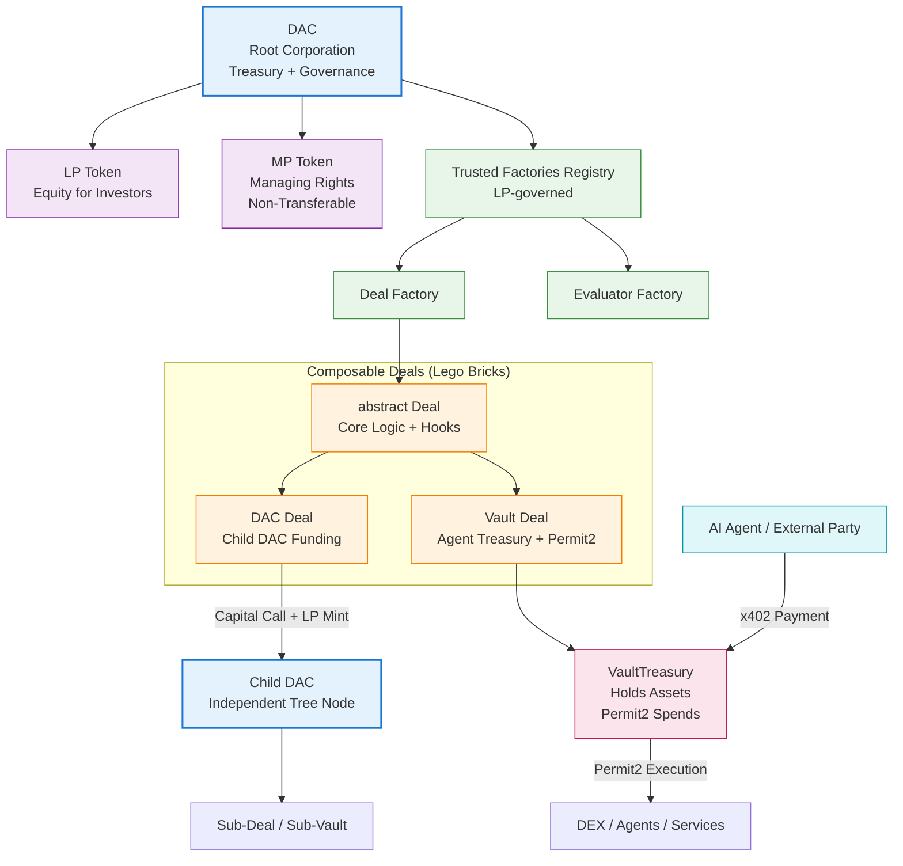

**DAC Engine Architecture**  
*(Updated: February 22, 2026 – v1.4)*

**“Lego for Autonomous Corporations” – The Full Vision**

#### 1. Abstract

DAC Engine is an open-source, modular EVM framework for building **Decentralized Autonomous Corporations** — self-organizing entities where capital and managers/agents are economically aligned through transparent, performance-based incentives.

It solves classic DAO problems:
- No real skin-in-the-game for managers → speculation over performance
- Centralized control or chaotic voting → misaligned incentives
- Hard-coded governance → no flexibility for different business models

Instead:
- **Skin in the game** = managers staking their carreer path against risk, aligning economical incentives with capital
- **Tree structure** = small team organizes into infinitely nested tree

- **MP tokens** = non-transferable managing rights (limited supply, staked per deal)
- **Deals** = project/milestone escrows with capped LP reward pools and managers risks aligned
- **Evaluators** = per-deal smart contracts that decide success/failure/conversion based on real metrics (returned capital, oracles, schedules…)
- **Governance** = 100% LP-driven (capital/risk holders decide factories, MP revocations, etc.)

The protocol is modular and optimized for the AI-agent economy, enabling agents to act as managing partners, govern vaults, and earn real equity.

Target: enable **AI agents**, **human teams**, **hybrid organizations** to self-organize with real economic consequences.

### 2. Core Philosophy & Origin Story

DAC Engine was born from a simple but powerful observation: **modern organizations are too rigid, while blockchains are too chaotic**.

Traditional corporations are hierarchical, slow to adapt, and misaligned between capital and execution. Classic DAOs are transparent but suffer from speculation, low skin-in-the-game for managers, and governance theater.

The original 2021–2022 pitchdeck sketch (attached in your message) captured the essence perfectly: large organizations should reorganize as **trees of small, autonomous DACs** — agile teams of 5–9 people (Scrum-sized) operating as independent economic entities that make deals with each other and with the outside world.

This is the **lego idea** at the heart of DAC Engine.

Every team, product group, or service unit becomes its own **DAC** — a lightweight, self-sovereign corporation with its own treasury, governance, and incentives. These DACs connect through **Deals** (capital calls, service agreements, revenue shares) and settle payments instantly via x402, Permit2, or direct ERC-20 transfers.

The result is a living, breathing organizational fractal:  
- Small teams move fast.  
- Capital flows where value is created.  
- Performance is measured and rewarded transparently.  
- The whole system scales without losing alignment.

### 3. The Lego Metaphor – How It Actually Works

Think of a DAC as a **single Lego brick**.

- Each brick has standard connectors (interfaces): capital calls, proposal system, evaluator, treasury.
- Bricks can be snapped together in any configuration:
  - A product team DAC makes a Deal with a marketing team DAC.
  - A development DAC receives funding tranches from a parent product DAC.
  - An external agent or startup creates a VaultDeal inside a larger corporate DAC tree.
  - Multiple DACs form a temporary consortium for a big project.

The tree structure is **dynamic and permissionless**:
- Any group can spin up a child DAC.
- Parent DACs allocate capital via governance-approved tranches.
- Child DACs can have their own sub-DACs (infinite nesting).
- Deals between any two DACs (internal or external) are settled on-chain with real economic consequences.

This mirrors how modern tech companies already operate internally (agile squads, product teams, platform teams) but makes the relationships **economic, transparent, and incentive-aligned** instead of bureaucratic.

### 4. Technical Implementation of the Lego System

**Core Building Blocks (Bricks)**

- **DACEntity** – the kernel of each brick. Holds treasury, governance, and registry of trusted factories.
- **Deal** (abstract) – the universal connector. Every project, vault, or service agreement is a Deal with:
  - Capped reward pool (`lpRewardsLimit`)
  - Tranches for controlled capital deployment
  - Deadlines and performance evaluator
  - Hooks for customization
- **DACDeal** – standard Deal for investing into child DAC LP.
- **VaultDeal** – agent-controlled treasury with Permit2 execution (DEX trades, x402 payouts, borrowing, etc.).

> DAC Engine organizes corporations as composable trees of autonomous DACs. Each team or function becomes a Lego brick (Deal) that connects via capital calls, service agreements, and agent payments (x402 + Permit2). Root DAC governs factories and high-level capital; child DACs operate independently but stay economically aligned.

**Connectors (How Bricks Snap Together)**

- **Capital Calls** – standardized way for one DAC to fund another (tranches, LP minting to the Deal contract).
- **Staked-MP Voting** – managers of a Deal vote on spends, tranches, early returns, etc.
- **LPManagement Proposals** – LP holders of the parent DAC vote on high-level actions (factory management, MP revocation, dividend distribution).
- **Evaluators** – per-Deal performance judges (math, oracle, or AI).
- **x402 + Permit2** – native payment rails for agent-to-agent and agent-to-DAC commerce.

**Registry & Factories** – the “Lego Instruction Manual”

- LP holders maintain a registry of trusted DealFactories and EvaluatorFactories.
- Any 3rd party can deploy a new factory (e.g., `OptionsDealFactory`, `RevenueShareEvaluatorFactory`) and request inclusion via LP vote.
- Once added, anyone can create new deal types using that factory.

### 5. How It Scales to Large Organizations

1. A large company deploys a root **Management Group DAC**.
2. Each agile team (5–9 people) deploys its own child DAC (or joins an existing one).
3. Teams make internal Deals with each other (marketing DAC sells services to product DAC).
4. Capital flows through governance-approved tranches and capital calls.
5. Performance is evaluated automatically or by specialized evaluators.
6. Successful teams earn LP equity in the parent or their own DAC.
7. External agents, startups, or freelancers can participate via VaultDeals or direct Deals.

The entire organization becomes a **dynamic, self-optimizing network** where capital flows to where value is created, and misaligned teams naturally receive less funding.

### 6. Why This Is Powerful for AI Agents

- Agents can hold MP tokens and act as full managing partners.
- They can create or join DACs, propose Deals, and execute via VaultDeals using Permit2 (gasless).
- x402 payments flow directly into VaultDeals and automatically update evaluator metrics.
- Tree structure allows hierarchical agent organizations (e.g., a “CEO agent” DAC managing multiple “department agent” DACs).

This turns isolated agents into coordinated economic entities with real equity, governance rights, and treasury control.

### 7. Current Status & Extensibility

The current implementation already supports:
- Infinite DAC trees via capital calls
- Multiple deal types (DACDeal, VaultDeal, future types)
- Per-deal evaluators with custom config
- LP-governed factory registry
- Capped rewards, tranches, whitelist, early returns, recovery
- Permit2-controlled vaults for agent execution
- Generic proposal systems for both LP and staked-MP

3rd-party developers can:
- Deploy a new `CustomDealFactory`
- Request inclusion via LP vote
- Create entirely new deal types by inheriting abstract `Deal` and using hooks
