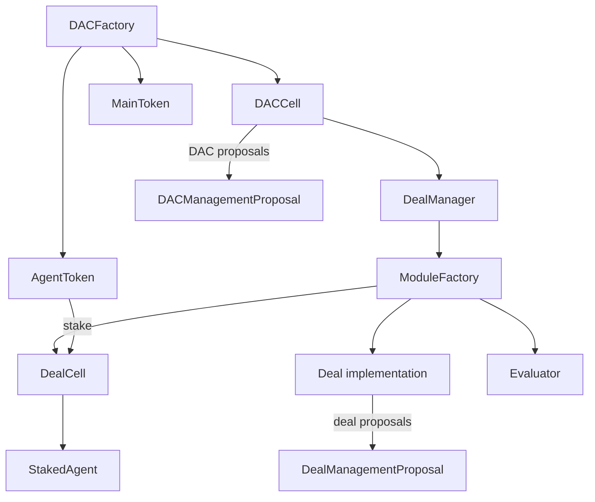

**DAC Cloud Contract Inventory**
**Implementation-aligned reference**
**Updated: March 13, 2026**

This file is the contract map for the current repository.

For deployment scripts, seeded scenario flows, and manifest formats, see [development.md](development.md).

## 1. Top-Level Architecture

## 2. Kernel Contracts

### `src/kernel/DACFactory.sol`
- Deploys new DACs.
- Predicts `DACCell` address with `CREATE2`.
- Deploys `MainToken`, `AgentToken`, and `DACCell`.
- Starts the DAC immediately or stores a deferred "sleeping cell" deployment for later activation.

### `src/kernel/DACCell.sol`
- DAC-level governance and treasury kernel.
- Stores DAC metadata, voting config, legal wrapper, and dividend state.
- Creates and executes DAC governance proposals.
- Tracks treasury balances and capital calls.
- Initializes the root capital call.

### `src/kernel/DealManager.sol`
- Registry and lifecycle controller for all deals created by a DAC.
- Holds the approved module-factory set for that DAC.
- Tracks per-deal state, evaluator list, reward caps, reward unlocks, and reward payments.
- Prevents controlled or unreleased `MainToken` balances from voting.
- Evaluates deals and applies evaluator actions.

### `src/kernel/DealCell.sol`
- Per-deal state container.
- Stores deal metadata, deadlines, tranches, whitelist state, early-return flag, veto flag, capital accounting, and claimable rewards.
- Mints and burns the deal's `StakedAgent`.
- Bridges the DAC, deal logic, and evaluator outputs.

### `src/kernel/Deal.sol`
- Abstract base contract for all deal logic.
- Hosts staked-agent governance proposals and lifecycle hooks.
- Delegates generic accounting/state to `DealCell` while retaining custom execution logic in child contracts.

### `src/kernel/ModuleFactory.sol`
- Abstract deployment layer for modules.
- Deploys a `DealCell`, concrete `Deal`, and concrete evaluator for a new deal.
- Used by `DealManager` through `IModuleFactory`.

### `src/kernel/proxies/UUPSProxy.sol`
- Lightweight ERC-1967 proxy used by factories for initialization-time deployment.
- In practice the deployed protocol treats these instances as immutable after initialization.

## 3. Kernel Factories

### `src/kernel/factories/DACCellFactory.sol`
- Deploys `DACCell` proxies.

### `src/kernel/factories/DealManagerFactory.sol`
- Deploys `DealManager` proxies.

### `src/kernel/factories/DealCellFactory.sol`
- Deploys `DealCell` proxies.

## 4. Governance Contracts

### `src/kernel/governance/Proposal.sol`
- Shared snapshot-voting base used by DAC and deal proposals.
- Supports quorum, blocking quorum, optional veto rights, resolution checks, and vote casting.

### `src/kernel/governance/DACManagementProposal.sol`
- DAC-level proposal contract using `MainToken` voting power.

### `src/kernel/governance/DealManagementProposal.sol`
- Deal-level proposal contract using `StakedAgent` voting power.

### `src/kernel/governance/DACManagementProposals.sol`
- DAC-level proposal type registry.
- Defines selectors for:
  - voting-config updates,
  - legal wrapper updates,
  - offchain approvals,
  - main-token mint/burn,
  - agent-token mint/revoke,
  - dividends,
  - capital calls,
  - module management,
  - deal and tranche approval,
  - deal recovery,
  - evaluator addition,
  - deal messages,
  - veto casting,
  - vote delegation.

### `src/kernel/governance/AbstractDealManagementProposals.sol`
- Base deal-proposal type registry.
- Defines selectors for:
  - voting-config updates,
  - tranche requests,
  - stake changes,
  - unstake permissions,
  - whitelist toggle,
  - early-return toggle,
  - DAC veto enablement,
  - evaluator-add permission.

### `src/kernel/governance/factories/DACManagementProposalFactory.sol`
- Deploys `DACManagementProposal`.
- Selects quorum mode based on proposal type.

### `src/kernel/governance/factories/DealManagementProposalFactory.sol`
- Abstract factory for `DealManagementProposal`.
- Applies kernel quorum rules for base deal proposals.
- Lets modules define additional quorum rules for module-specific proposals.

## 5. Token Contracts

### `src/kernel/tokens/MainToken.sol`
- DAC main token.
- Transferable `ERC20Votes`.
- Mint capped by `maxSupply`.
- Delegation restricted through `DealManager` checks for controlled balances.

### `src/kernel/tokens/AgentToken.sol`
- DAC agent token.
- Minted and revoked through DAC governance.
- Stake source for joining deals.

### `src/kernel/tokens/StakedAgent.sol`
- Per-deal non-transferable `ERC20Votes`.
- Represents staked participation inside a deal.

### `src/kernel/tokens/factories/TokenFactories.sol`
- Contains:
  - `MainTokenFactory`
  - `AgentTokenFactory`
  - `StakedAgentFactory`

## 6. Kernel Libraries

### `src/kernel/libraries/DACDeployment.sol`
- Predicts `DACCell` addresses for factory deployments.

### `src/kernel/libraries/DACCellGovernanceLib.sol`
- Core DAC-side orchestration logic.
- Creates deal proposals, DAC proposals, tranches, evaluator additions, reward minting, and evaluator execution.

### `src/kernel/libraries/DACCellCapitalLib.sol`
- Handles capital calls, treasury deposits, treasury recovery, and dividend claims.

### `src/kernel/libraries/DealCellGovernanceLib.sol`
- Handles deal staking, unstaking, claim flows, tranche requests, capital return, reward allocation, and slashing.

### `src/kernel/libraries/MathLib.sol`
- Shared fixed-point math library used across voting and evaluator logic.

## 7. Core Module Contracts

### `src/modules/core/CoreModuleFactory.sol`
- Active module factory shipped with the repository.
- Maps supported deal kinds and evaluator kinds to concrete factories.

### `src/modules/core/CoreModuleDeals.sol`
- Declares current core deal/evaluator selectors:
  - `DAC_DEAL`
  - `PERMIT2_TREASURY` (the selector used for `TreasuryDeal`)
  - `MILESTONES_EVALUATOR`
  - `REVENUE_EVALUATOR`

### `src/modules/core/governance/CoreDealManagementProposals.sol`
- Core-module proposal selector registry.
- Covers child-DAC actions and treasury-management actions.

### `src/modules/core/governance/factories/CoreDealManagementProposalFactory.sol`
- Concrete deal-governance factory for core module proposals.
- Applies quorum rules for the selectors defined above.

## 8. Core Deal Implementations

### `src/modules/core/deals/DACDeal.sol`
- Deal type for owning and funding a child DAC.
- Can deploy a new child DAC or connect to an existing one.
- Fulfills child capital calls on tranche approval.
- Returns the child DAC `MainToken` position to the parent DAC when the deal closes.

### `src/modules/core/deals/TreasuryDeal.sol`
- Deal type for a governed treasury / execution wallet.
- Owns a dedicated `Permit2Treasury`.
- Supports spend approvals, agent allowances, receive permissions, capital return, and treasury vote delegation.

### `src/modules/core/deals/Permit2Treasury.sol`
- Asset-holding treasury controlled by `TreasuryDeal`.
- Supports:
  - Permit2 spend approvals,
  - direct spends,
  - agent receive permissions,
  - agent spend allowances,
  - capital return to the deal,
  - compatible-token vote delegation.

### `src/modules/core/deals/factories/DACDealFactory.sol`
- Deploys `DACDeal`.

### `src/modules/core/deals/factories/TreasuryDealFactory.sol`
- Deploys `TreasuryDeal`.
- Also deploys the shared `Permit2TreasuryFactory`.

## 9. Evaluators

### `src/modules/core/evaluators/MilestoneBasedEvaluator.sol`
- Milestone schedule evaluator.
- Supports reward and penalty curves, extensions, and close milestones.

### `src/modules/core/evaluators/RevenueBasedEvaluator.sol`
- Recurring revenue evaluator.
- Supports periodic unlocks, missed-cycle penalties, and optional auto-close.

### `src/modules/core/evaluators/factories/MilestoneEvaluatorFactory.sol`
- Deploys `MilestoneBasedEvaluator`.

### `src/modules/core/evaluators/factories/RevenueEvaluatorFactory.sol`
- Deploys `RevenueBasedEvaluator`.

## 10. Shared Interfaces and Structs

### `src/interfaces/Structs.sol`
- Shared config and message structs:
  - `DACConfig`
  - `VotingConfig`
  - `LegalWrapper`
  - `CapitalCall`
  - `ProposalParams`
  - `DealParams`
  - `EvaluationResult`
  - `Tranche`

### `src/kernel/interfaces/Structs.sol`
- Kernel runtime state structs:
  - `DealState`
  - `CapitalCallState`

### `src/modules/core/interfaces/Structs.sol`
- Core-module config structs:
  - `DACDealConfig`
  - `TreasurySpendAllowance`
  - `Milestone`
  - `RevenueSchedule`

### Other key interfaces
- `src/interfaces/IDACCell.sol`
- `src/interfaces/IDealManager.sol`
- `src/interfaces/IDealCell.sol`
- `src/interfaces/IDeal.sol`
- `src/interfaces/IModuleFactory.sol`
- `src/interfaces/IEvaluator.sol`
- `src/kernel/interfaces/IDACCellAdapter.sol`
- `src/kernel/interfaces/IDealCellAdapter.sol`
- `src/kernel/interfaces/IDealManagerAdapter.sol`

## 11. Event and Error Catalogs

### `src/interfaces/DACEventsLib.sol`
- Central event catalog for DAC creation, proposals, funding, staking, evaluation, rewards, and capital returns.

### `src/interfaces/DACErrorsLib.sol`
- Central custom-error catalog shared across the system.

## 12. Current Contract Relationships

| Contract | Owns / deploys | Governs / controls | Main purpose |
|---|---|---|---|
| `DACFactory` | `DACCell`, `MainToken`, `AgentToken` | none after init | bootstrap DACs |
| `DACCell` | root capital calls, DAC proposals | DAC treasury and policy | DAC kernel |
| `DealManager` | deals registry, evaluator registry | active deals, reward safety | DAC execution router |
| `DealCell` | `StakedAgent` | one deal's state and staking | deal shell |
| `Deal` | module-defined logic | one deal's actions | deal brain |
| `CoreModuleFactory` | core deals and evaluators | module deployment | module system |
| `DACDeal` | child DAC position | child-DAC funding flow | structured child DAC investment |
| `TreasuryDeal` | `Permit2Treasury` | treasury execution | governed operational wallet |
