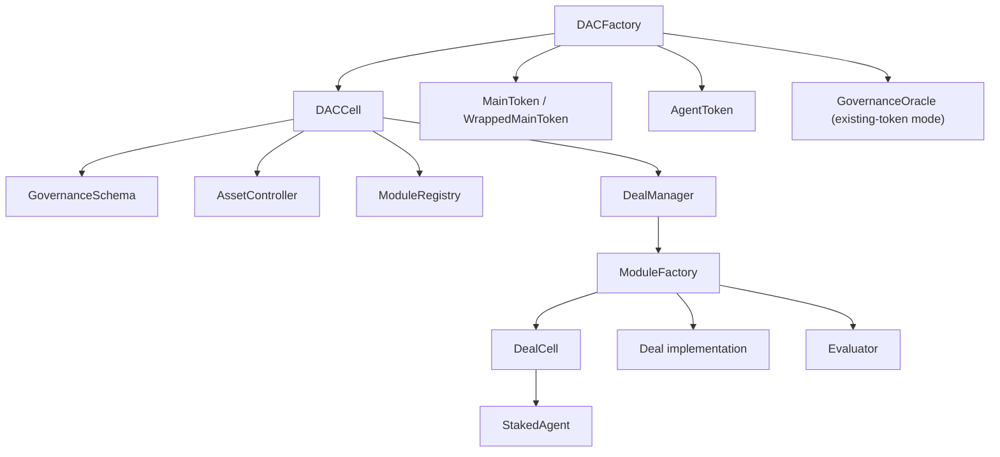

# DAC Cloud Contract Inventory

Updated: April 7, 2026

For the architectural overview, see [architecture.md](architecture.md). For scripts and manifests, see [development.md](development.md).

## 1. Current Topology

## 2. DAC Deployment Contracts

### `src/kernel/DACFactory.sol`

Protocol bootstrap contract.

Current responsibilities:

- deploy native DACs through `deployDAC(...)`
- deploy existing-token DACs through `deployExistingTokenDAC(...)`
- predict deterministic DAC addresses
- deploy wrapper/oracle primitives for existing-token mode
- seed wrapped treasury balances for existing-token DACs
- emit `DACDeployed` and `ExistingTokenDACDeployed`

### `src/kernel/libraries/DACDeployment.sol`

Helper library used for deterministic address prediction.

## 3. DAC Kernel Contracts

### `src/kernel/DACCell.sol`

DAC micro-kernel.

Current responsibilities:

- DAC metadata
- pointers to:
  - main token
  - agent token
  - deal manager
  - module registry
  - asset controller
  - governance schema
- DAC proposal creation and execution routing
- legal-wrapper message logging
- root capital-call bootstrap in native mode
- asset-controller treasury sync entrypoints
- DAC-level event emission

### `src/kernel/DealManager.sol`

Deal lifecycle controller.

Current responsibilities:

- create deals through approved modules
- keep the deal registry
- keep per-deal state and evaluator registry
- approve funding and tranches
- route evaluator output
- determine recoverability / active lifecycle state
- interact with the asset controller for reward and main-asset accounting

### `src/kernel/DealCell.sol`

Per-deal state shell.

Current responsibilities:

- holds generic deal state
- staking bridge between `AgentToken` and `StakedAgent`
- enforces `agentsLimit` (maximum number of stakers per deal)
- enforces `minimalStake` (minimum stake amount per agent)
- tranche state
- whitelist / early-return state
- reward distribution state
- deal reward-pool split and deal-owned reward claim state
- recovery state
- generic deal-governance dispatch before forwarding module-specific behavior

### `src/kernel/Deal.sol`

Abstract module execution contract.

Current responsibilities:

- deal-level proposal execution routing
- generic lifecycle hooks
- module-specific logic extension surface
- standardized `DealRelatedContract` discovery helper
- generic claim entrypoint for deal-owned reward pools via `claimDealRewardPool(...)`

The deal contract intentionally stays lean; DAC challenge state lives on deal proposal contracts instead of in `Deal`.

## 4. Governance Boundary Contracts

### `src/interfaces/IGovernanceSchema.sol`

Common DAC governance policy interface.

Main methods:

- create/consume DAC proposals
- set/get voting config
- set/get deal-creation config
- set/get governance strategy config
- set/get governance oracle

### `src/kernel/governance/NativeGovernanceSchema.sol`

Native DAC governance policy.

Uses:

- `MainToken` delegated votes for qualification
- `VotingConfig` for native DAC proposal rules

Handles:

- proposal-type gating
- validation of native voting config
- capability-aware proposal support via the asset controller

### `src/kernel/governance/HybridGovernanceSchema.sol`

Existing-token DAC governance policy.

Uses:

- `WrappedMainToken` delegated votes for qualification
- `GovernanceStrategyConfig` for oracle/fallback behavior
- `GovernanceOracle` address management

Handles:

- hybrid proposal deployment
- oracle-based governance strategy validation
- wrapped-only bootstrap mode when `oraclePrimaryEnabled == false`
- blocking behavior toggles for all proposals / high-quorum proposals
- fallback durations and execution-validity configuration
- capability-aware proposal support via the asset controller

### `src/kernel/governance/GovernanceOracle.sol`

Oracle publisher for hybrid DAC governance.

Features:

- admin-controlled publisher set
- proposal-specific snapshot publication
- deactivation path
- indexer-facing publisher/deactivation events

### `src/kernel/governance/Proposal.sol`

Shared base for timestamp-based proposal resolution and execution validity.

Current shared behaviors:

- vote casting
- resolution logic
- blocking quorum logic
- execution-validity window
- executable / expired / executed state

### `src/kernel/governance/DACManagementProposal.sol`

Native DAC proposal contract.

Uses:

- `MainToken` snapshot voting
- neutral proposal semantics
- no veto-specific behavior

### `src/kernel/governance/HybridDACManagementProposal.sol`

Existing-token DAC proposal contract.

Features:

- `AwaitingOracleSnapshot`
- `PrimaryVoting`
- `FallbackWarmup`
- `FallbackVoting`
- `Resolved`

Supports:

- wrapped voting
- Merkle voting
- emergency fallback after oracle deactivation
- execution-validity window after resolution

### `src/kernel/governance/DealManagementProposal.sol`

Deal-level proposal contract.

Uses:

- `StakedAgent` snapshot voting
- challengeable-execution model
- execution-validity window

Stores:

- whether the proposal is DAC-challengeable
- the linked DAC challenge proposal, if any

This contract covers both voluntary and forced deal exits:

- `PERMIT_UNSTAKE`
- `STRIKE_OUT_AGENT`

### Governance factories

- `src/kernel/governance/factories/DACManagementProposalFactory.sol`
- `src/kernel/governance/factories/HybridDACManagementProposalFactory.sol`
- `src/kernel/governance/factories/DealManagementProposalFactory.sol`
- `src/kernel/governance/factories/NativeGovernanceSchemaFactory.sol`
- `src/kernel/governance/factories/HybridGovernanceSchemaFactory.sol`
- `src/kernel/governance/factories/GovernanceOracleFactory.sol`

These deploy the governance implementations through proxy-backed factory flows.

## 5. Treasury and Asset Boundary Contracts

### `src/interfaces/IAssetController.sol`

Common asset-controller interface.

Main responsibilities exposed at interface level:

- treasury deposits and treasury sync
- capital-call creation and fulfillment
- dividend payout registration and claim settlement
- deal funding approval
- main reward settlement
- DAC-managed distributor registry for `AgentToken`
- mint/burn support
- vote delegation for DAC-held assets
- controlled-address registration
- votable-supply and obligation views
- capability introspection

### `src/kernel/controllers/NativeAssetController.sol`

Native DAC treasury and main-asset policy implementation.

Handles:

- main-token treasury accounting
- native main-token obligations
- dividend payout commitments
- capital calls
- controlled address registration
- released-votable accounting
- DAC-managed `AgentToken` distributor allowances and recipient validation

### `src/kernel/controllers/ExistingTokenAssetController.sol`

Existing-token DAC treasury and wrapped-main-asset policy implementation.

Handles:

- wrapped treasury custody
- reserve-backed reward commitments
- reserve-backed dividend commitments
- wrapped votable-supply exclusions
- wrapped move/delegate hooks
- reserve-backed capital calls from wrapped inventory
- DAC-managed `AgentToken` distributor allowances and recipient validation

### Asset-controller factories

- `src/kernel/factories/AssetControllerFactory.sol`
- `src/kernel/factories/ExistingTokenAssetControllerFactory.sol`

## 6. Module Approval and Discovery

### `src/interfaces/IModuleRegistry.sol`

Minimal approved-module registry interface.

### `src/kernel/ModuleRegistry.sol`

Canonical DAC-owned approved-module storage.

### `src/interfaces/IModuleFactory.sol`

Module deployment and discovery interface.

`IModuleFactory.deployDeal` deploys only the `DealCell` and `Deal` for a given deal. `IModuleFactory.deployEvaluator` is called separately by the kernel to deploy the evaluator, allowing the evaluator to use a different module than the deal itself. Evaluator deployment is kernel-controlled.

Current discovery surface includes:

- `moduleId()`
- `moduleVersion()`
- `moduleManifestURI()`
- `supportedDealKinds()`
- `supportedEvaluatorKinds()`
- `supportsDealKind(...)`
- `supportsEvaluatorKind(...)`
- `supportsDealRewardPool(...)`

### `src/kernel/ModuleFactory.sol`

Abstract module factory base used by concrete modules.

## 7. Token Contracts

### `src/kernel/tokens/MainToken.sol`

Native DAC governance token.

- `ERC20Votes`
- capped supply
- mint/burn hooks routed through DAC-controlled components

### `src/kernel/tokens/WrappedMainToken.sol`

Existing-token DAC wrapper.

Features:

- 1:1 wrap / unwrap against an underlying ERC-20
- `ERC20Votes`
- auto-self-delegation on first wrap
- move/delegate notifications to the asset controller
- explicit `Wrapped` / `Unwrapped` events

### `src/kernel/tokens/AgentToken.sol`

DAC operator token.

Used for:

- DAC-level operator issuance/revocation
- distributor inventory fanout into bound agent balances
- deal-creation anti-spam requirements
- staking into deals

Key semantics:

- distributor inventory is transferable only from DAC-approved distributor wallets
- distributed balances become bound / non-transferable at the recipient
- qualification-sensitive checks use `qualifiedBalanceOf(...)`, which excludes distributor inventory

### `src/kernel/tokens/StakedAgent.sol`

Per-deal non-transferable `ERC20Votes` token used for deal governance.

### Token factories

- `src/kernel/tokens/factories/TokenFactories.sol`
- `src/kernel/tokens/factories/WrappedMainTokenFactory.sol`

## 8. Proxy and Factory Infrastructure

### Proxy contract

- `src/kernel/proxies/UUPSProxy.sol`

The system uses proxy deployment for size and deployment-gas reasons, but the kernel/core-module deployment model remains operationally non-upgradeable.

### Core kernel factories

- `src/kernel/factories/DACCellFactory.sol`
- `src/kernel/factories/DealManagerFactory.sol`
- `src/kernel/factories/DealCellFactory.sol`
- `src/kernel/factories/ModuleRegistryFactory.sol`

## 9. Deal and Module Contracts

### `src/modules/core/CoreModuleFactory.sol`

Current shipped module factory.

Supports:

- `DACDeal`
- `TreasuryDeal`
- milestone evaluator
- revenue evaluator

The core module also declares reward-pool support through `supportsDealRewardPool(...)` for its shipped deal kinds.

Evaluator deployment is kernel-controlled and handled separately from deal deployment. The evaluator can use a different module factory than the deal, as specified by `DealParams.evaluatorModuleFactory`. `IModuleFactory.deployDeal` deploys only the `DealCell` and `Deal`; `IModuleFactory.deployEvaluator` is called separately by the kernel.

### `src/modules/core/CoreModuleDeals.sol`

Selector registry for the shipped core deal/evaluator kinds.

### `src/modules/core/governance/CoreDealManagementProposals.sol`

Core-module proposal selector registry for:

- treasury operations
- child-DAC operations

### `src/modules/core/governance/factories/CoreDealManagementProposalFactory.sol`

Quorum-policy factory for core module deal proposals.

## 10. Core Deal Implementations

### `src/modules/core/deals/DACDeal.sol`

Child-DAC deal implementation.

Capabilities:

- deploy/connect child DACs
- fulfill child capital calls
- create and vote child DAC proposals
- reinvest profits
- return profits
- emit `DealRelatedContract` for child DAC and child token discovery

### `src/modules/core/deals/TreasuryDeal.sol`

Operational treasury deal.

Capabilities:

- direct spend governance
- Permit2 spend approvals
- agent spend/receive permissions
- vote delegation for treasury-held vote tokens
- profits recovery
- related treasury discovery event emission

### `src/modules/core/deals/Permit2Treasury.sol`

Treasury wallet owned by `TreasuryDeal`.

Features:

- direct spends
- Permit2 receive/spend support
- agent allowance enforcement
- capital return to the deal

### Deal factories

- `src/modules/core/deals/factories/DACDealFactory.sol`
- `src/modules/core/deals/factories/TreasuryDealFactory.sol`

## 11. Evaluators

### `src/modules/core/evaluators/MilestoneBasedEvaluator.sol`

Milestone-driven evaluator with:

- reward curves
- slash curves
- extension support
- close milestones

### `src/modules/core/evaluators/RevenueBasedEvaluator.sol`

Recurring revenue evaluator with:

- requirement curves
- unlock curves
- missed-cycle penalties
- optional close behavior

### Evaluator factories

- `src/modules/core/evaluators/factories/MilestoneEvaluatorFactory.sol`
- `src/modules/core/evaluators/factories/RevenueEvaluatorFactory.sol`

## 12. Shared Struct and Interface Files

### `src/interfaces/Structs.sol`

Key shared structs:

- `DACConfig`
- `ExistingDACConfig`
- `VotingConfig`
- `CapitalCall`
- `ProposalParams`
- `DealParams`
- `EvaluationResult`
- `Tranche`

`DealParams` fields of note:

- `dealRewardPoolPercent` — percentage of deal funding allocated to the deal reward pool
- `evaluatorModuleFactory` — module factory for evaluator deployment; `address(0)` means use the deal's own module factory
- `agentsLimit` — maximum number of stakers in a deal; `0` means no limit
- `minimalStake` — minimum stake per agent; `0` means no minimum

### `src/interfaces/GovernanceStructs.sol`

Key governance/accounting structs and enums:

- `DACMode`
- `ProposalPhase`
- `AssetCapability`
- `CommitmentKind`
- `AgentTokenMintAction`
- `GovernanceStrategyConfig`
- `DealCreationConfig`
- `AssetControllerConfig`
- `ExistingTokenConfig`
- `OracleSnapshot`

### Important external interfaces

- `src/interfaces/IDACCell.sol`
- `src/interfaces/IDACFactory.sol`
- `src/interfaces/IDealManager.sol`
- `src/interfaces/IDealCell.sol`
- `src/interfaces/IDeal.sol`
- `src/interfaces/IManagementProposal.sol`
- `src/interfaces/IVoting.sol`
- `src/interfaces/IExecutableProposal.sol`
- `src/interfaces/IDealChallengeableProposal.sol`
- `src/interfaces/IGovernanceOracle.sol`
- `src/interfaces/IGovernanceSchema.sol`
- `src/interfaces/IAssetController.sol`
- `src/interfaces/IModuleFactory.sol`
- `src/interfaces/IModuleRegistry.sol`

## 13. Event and Error Catalogs

### `src/interfaces/DACEventsLib.sol`

Central event catalog.

Important current groups:

- DAC deployment and startup
- DAC proposal lifecycle
- treasury and capital calls
- dividends
- module approval
- generic proposal voting/resolution
- oracle lifecycle
- wrapper lifecycle
- agent distributor lifecycle
- deal lifecycle
- deal challenge state
- deal reward-pool allocation and settlement
- module-related runtime address discovery

### `src/interfaces/DACErrorsLib.sol`

Shared custom error catalog used across the kernel, controllers, governance layer, and modules.

Errors of note:

- `AgentsLimitReached` — reverts when a deal's staker count would exceed `agentsLimit`
- `InsufficientStake` — reverts when a staking amount is below `minimalStake`
- `EvaluatorNotCompatible` — reverts when the evaluator module does not support the requested evaluator kind

## 14. Supporting Libraries

- `src/kernel/libraries/DACCellGovernanceLib.sol` — governance routing helpers used by `DACCell`
- `src/kernel/libraries/DACCellCapitalLib.sol` — capital-call and treasury helpers used by `DACCell`
- `src/kernel/libraries/DealCellGovernanceLib.sol` — governance routing helpers used by `DealCell`
- `src/kernel/libraries/MathLib.sol` — shared fixed-point and percentage math utilities
