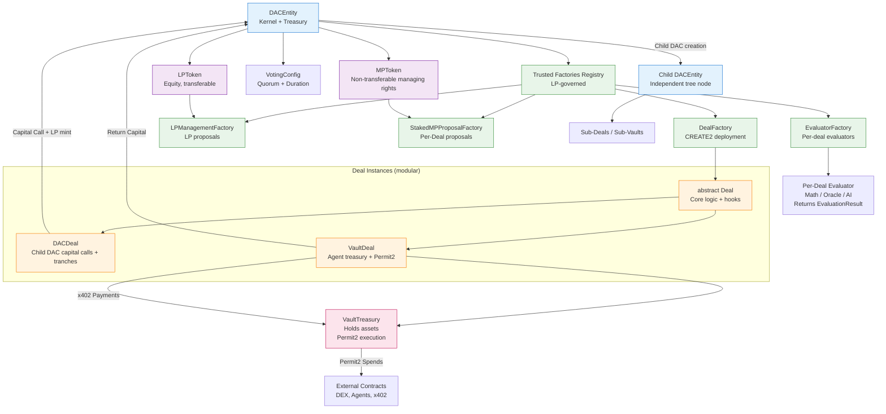

**DAC_contracts.md**  
**v1.0 – February 22, 2026**  
**Complete Contract Inventory & Responsibilities**

This document serves as the single source of truth for all contracts in the DAC Engine codebase. It lists every deployed contract, its purpose, key responsibilities, and how it interacts with others.

### Relationships diagram

### Core Kernel & Shared Contracts

1. **DACEntity.sol**  
   **Role**: The central kernel / corporation OS of each DAC.  
   **Key Responsibilities**:
    - Holds the treasury (ERC-20 only)
    - Manages LP/MP token minting/burning
    - Maintains registry of trusted deal & evaluator factories (LP-governed)
    - Executes LP proposals (generic command pattern via LPManagementProposal)
    - Creates Deals via registered factories
    - Evaluates Deals (calls per-deal evaluator)
    - Governs voting config, oracles, and global parameters

2. **Deal.sol** (abstract base)  
   **Role**: Shared core logic for all deal types.  
   **Key Responsibilities**:
    - MP staking/unstaking
    - Deadlines (approve/deal)
    - Capped reward pool (`lpRewardsLimit`) & pro-rata distribution
    - Hooks for customization (`_beforeStake`, `_afterApprove`, etc.)
    - Generic staked-MP proposal system (via StakedMPProposal)
    - Basic governance actions (earlyReturns toggle, etc.)

3. **DACDeal.sol**  
   **Role**: Standard deal for investing into child DAC LP.  
   **Key Responsibilities**:
    - Handles capital calls to child DAC (tranches)
    - Manages child proposal voting & execution (proxy voting)
    - Overrides `onApproved` for capital call fulfillment

4. **VaultDeal.sol**  
   **Role**: Agent-controlled treasury vault.  
   **Key Responsibilities**:
    - Controls VaultTreasury via quorum-approved Permit2 spends
    - Supports two staked-MP proposal types: `ApprovePermit2Spend`, `ReturnCapitalToDAC`
    - Returns only original funding token to parent DAC
    - Integrates with x402 payment flows (incoming receipts)

5. **VaultTreasury.sol**  
   **Role**: Asset-holding contract controlled by VaultDeal.  
   **Key Responsibilities**:
    - Holds ERC-20 tokens
    - Executes Permit2-approved spends (on-chain approve + execute)
    - Returns capital to parent VaultDeal (only funding token)
    - Receives x402 payments (agent-friendly)

### Token Contracts

6. **LPToken.sol**  
   **Role**: Equity token of the DAC.  
   **Key Responsibilities**:
    - Minted only by DACEntity
    - Freely transferable
    - Used for LP governance and reward distribution

7. **MPToken.sol**  
   **Role**: Non-transferable managing rights.  
   **Key Responsibilities**:
    - Minted/burned only by DACEntity
    - Staked into Deals (via `stakeToDeal`)
    - Non-transferable by design

### Proposal & Voting Contracts

8. **LPManagementProposal.sol**  
   **Role**: LP-governed proposals (generic command pattern).  
   **Key Responsibilities**:
    - Stores proposal parameters (`typ`, `target`, `amount`, `data`)
    - Decodes `data` for type-specific execution
    - Handles MintMP, Dividend, CapitalCall, factory management, MP revocation, etc.

9. **StakedMPProposal.sol**  
   **Role**: Staked-MP-governed proposals per Deal.  
   **Key Responsibilities**:
    - Stores deal-specific actions (tranche requests, Permit2 approves, early returns, etc.)
    - Decodes `data` for execution
    - Votes weighted by StakedMP balance

10. **Proposal.sol** (abstract base)  
    **Role**: Shared voting logic for both LP and staked-MP proposals.  
    **Key Responsibilities**:
    - Implements basic quorum/blocking voting
    - Handles `vote`, `isResolved`, `outcome`

### Factories

11. **DACFactory.sol**  
    **Role**: Deploys new DACs with CREATE2 (deterministic addresses).  
    **Key Responsibilities**:
    - Deploys LPToken, MPToken, DACEntity
    - Predictable addresses via salt

12. **DealFactory.sol**  
    **Role**: Deploys Deal instances (DACDeal, VaultDeal, future types).  
    **Key Responsibilities**:
    - Deploys child deal + evaluator
    - Uses CREATE2 for predictability

13. **LPManagementFactory.sol**  
    **Role**: Deploys generic LP proposals.

14. **StakedMPProposalFactory.sol**  
    **Role**: Deploys per-deal staked-MP proposals.

15. **EvaluatorFactory.sol** (example: BasicEvaluatorFactory)  
    **Role**: Deploys per-deal evaluators with custom config.

### Supporting Contracts

16. **VotingFactory.sol**  
    **Role**: Deploys Voting instances (now optional with Proposal base).

### Summary Table – Quick Reference

| Contract                  | Type         | Deployed By          | Governance By     | Key Feature                          |
|---------------------------|--------------|----------------------|-------------------|--------------------------------------|
| DACEntity                 | Kernel       | DACFactory           | LP holders        | Treasury, registry, LP/MP minting    |
| Deal (abstract)           | Base         | —                    | —                 | Shared staking, rewards, hooks       |
| DACDeal                   | Deal type    | DealFactory          | Staked-MP         | Child DAC capital calls              |
| VaultDeal                 | Deal type    | DealFactory          | Staked-MP         | Permit2 treasury control             |
| VaultTreasury             | Treasury     | VaultDeal            | VaultDeal         | Permit2 spends, x402 receives        |
| LPToken                   | Token        | DACFactory           | —                 | Transferable equity                  |
| MPToken                   | Token        | DACFactory           | —                 | Non-transferable managing rights     |
| LPManagementProposal      | Proposal     | LPManagementFactory  | LP holders        | Generic LP commands                  |
| StakedMPProposal          | Proposal     | StakedMPProposalFactory | Staked-MP      | Per-Deal governance                  |
| Proposal (abstract)       | Base         | —                    | —                 | Shared voting logic                  |
| DACFactory                | Factory      | —                    | —                 | CREATE2 DAC deployment               |
| DealFactory               | Factory      | —                    | —                 | Deal + evaluator deployment          |

### Final Notes

- All governance is now **LP or Staked-MP driven** — no deployer backdoors.
- The system is **highly modular**: new deal types only need to inherit `Deal` and override hooks/proposal handlers.
- **3rd-party extensibility** is ready: deploy a new factory → LP vote to trust it → anyone can create new deal instances.

This document is now your single reference for "what contract does what".

Let me know if you want:
- To add a visual diagram (text or Mermaid)
- To split into sub-documents (e.g., `DAC_vaults.md`, `DAC_deals.md`)
- Or to move to the next code task (tests, x402 integration, deployment scripts, etc.)

We’re in excellent shape — the architecture is now very clear, secure, and ready for real-world use.

What’s next on your mind? 🚀