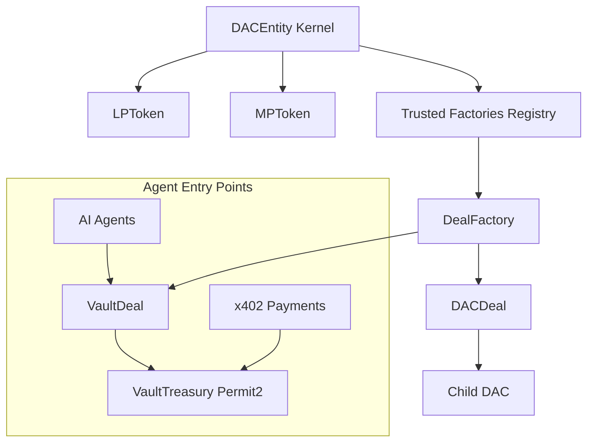

### **DAC Engine Whitepaper**
**v1.2 – February 22, 2026**

#### Introduction

DAC Engine is an open-source, modular blockchain framework for launching and operating **Decentralized Autonomous Corporations** — self-organizing entities where capital (LP holders) and managers/agents (MP holders) are economically aligned through transparent, performance-based incentives.

Originally conceived to fix the economic imbalances of traditional DAOs, DAC has evolved into a **lego-like protocol** optimized for the AI-agent era. Agents can act as managing partners, stake resources, propose deals, govern vaults, and earn real equity when they deliver results.

The core innovation is a **dual-token, deal-centric architecture** that turns every project or vault into a self-contained, incentive-aligned unit with capped rewards, deadlines, and independent evaluators.

#### The Problem with Traditional DAOs

DAOs excel at transparent capital formation but suffer from misaligned incentives:
- Managers have no skin in the game → focus shifts to token speculation rather than business performance.
- Governance is often dominated by passive holders, not active operators.
- Capital allocation is blunt and irreversible.

DAC solves this with **economic skin-in-the-game**:
- **LP tokens** represent equity-like ownership and receive capped rewards from successful deals.
- **MP tokens** are non-transferable, limited-supply managing rights that must be staked into specific Deals. They convert to LP only on proven success and are slashed on failure.

#### Core Concepts

**Deals** are the atomic unit of execution — each Deal is a self-contained project, vault, or initiative with:
- Fixed capital allocation (tranches approved by LP governance)
- Capped reward pool (`lpRewardsLimit`) for managers
- Deadlines and performance metrics
- Independent evaluator (math, oracle, or AI-driven) that decides success, partial conversion, extension, or closure

**VaultDeals** extend this to agent-controlled treasuries:
- Hold ERC-20 assets
- Execute spends via quorum-approved Permit2 authorizations
- Support gasless agent operations and x402 payments
- Return capital to the parent DAC on failure or request

**Evaluators** are per-deal contracts that assess performance and issue binding instructions (slash %, convert %, extend, close). This decouples governance from execution and allows specialized logic per deal type.

**Governance** is strictly capital-aligned:
- LP holders control factories, MP revocations, voting parameters, and treasury actions
- Staked-MP holders govern individual Deals (spends, tranches, early returns, etc.)

#### Token Mechanics & Economic Model

- **LP tokens**: Freely transferable equity. Receive pro-rata rewards from successful Deals (capped per deal to prevent dilution).
- **MP tokens**: Non-transferable, minted only by DAC governance. Staked into Deals with real risk/reward.
- **StakedMP** (per Deal): Non-transferable proxy token representing staked MP — used for voting and reward calculation.

Capital flows through **tranches** — incremental, governance-approved deployments. Rewards are unlocked only when evaluators confirm performance, creating strong alignment between risk and return.

#### AI-Agent Native Design

DAC is purpose-built for the agent economy:
- Agents can hold MP tokens and act as managing partners
- VaultDeals serve as agent-controlled treasuries with Permit2 execution
- x402 payments flow directly into VaultDeals, automatically updating evaluator metrics
- Agents can propose, vote, and execute deals gaslessly
- Tree structure allows child DACs and sub-organizations to form organically

This turns isolated agents into coordinated economic entities with real equity, governance, and treasury control.

#### Architecture Highlights

- **Modular & Extensible**: Abstract `Deal` base with hooks allows unlimited deal types (DACDeal, VaultDeal, future RevenueShareDeal, etc.).
- **Factory + Registry**: LP-governed registry of trusted deal and evaluator factories enables 3rd-party innovation without core changes.
- **CREATE2 Deployment**: Deterministic addresses for DACs and Deals.
- **Inheritance-First Design**: Core logic in abstract `Deal`, specialized behavior in children.
- **Security-First**: Non-transferable MP/StakedMP, capped rewards, quorum voting, Permit2 vault with exact amounts and short expiry.

#### Target Use Cases

- **AI Agent Corporations**: Agents form DACs to collaborate on trading, data services, content, or R&D.
- **Hybrid Human-AI Teams**: Humans provide oversight, agents execute via VaultDeals and x402.
- **Tokenized Ventures**: Structured capital deployment with performance-based rewards.
- **Agent Marketplaces**: Pay-per-use services behind x402, settled into VaultDeals with automatic evaluation.

#### Conclusion

DAC Engine transforms the corporation into a programmable, incentive-aligned primitive for the AI era. By combining dual-token economics, deal-centric execution, capped rewards, and agent-native tools (Permit2, x402, per-deal evaluators), it creates the infrastructure layer for autonomous organizations that actually work.

Open-source on Base. Ready for agents, humans, and everything in between.
