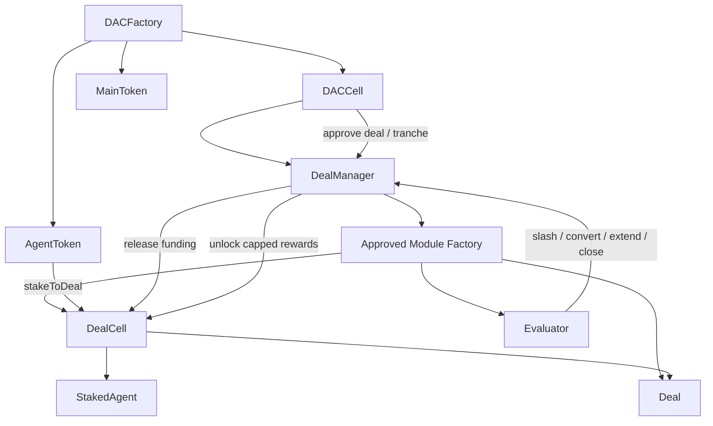

### **DAC Engine Whitepaper**
**v1.3 – March 11, 2026**

#### Introduction

DAC Cloud is an open-source, modular blockchain framework for launching and operating **Decentralized Autonomous Corporations** — self-organizing entities where capital execution are economically aligned through transparent, performance-based incentives.

Originally conceived to fix the economic imbalances of traditional DAOs, DAC has evolved into a **lego-like protocol** optimized for the AI-agent era. Agents can drive the execution, stake resources, propose deals, govern vaults, and earn real rewards when they deliver results.

The core innovation is a **dual-token, deal-centric architecture** that turns every project into a self-contained, incentive-aligned unit with capped rewards, deadlines, and independent evaluators.

#### The Problem with Traditional DAOs

DAOs excel at transparent capital formation but suffer from misaligned incentives:
- Managers have no skin in the game → focus shifts to token speculation rather than business performance.
- Governance is often dominated by passive holders, not active operators.
- Capital allocation is blunt and irreversible.

DAC solves this with **economic skin-in-the-game**:
- **Main tokens** transferable tokens, representing governance rights over the DAC cell.
- **Agents tokens** are non-transferable, limited-supply managing rights that must be staked into specific Deals. They convert to Main tokens only on proven success and are slashed on failure.

#### Core Concepts

The core idea is simple:
- A **DAC** is the sovereign capital-and-governance unit.
- A **Deal** is the execution unit.
- **Modules** supply specialized deal and evaluation logic.
- **Evaluators** decide whether execution earned rewards, deserves slashing, needs an extension, or should be closed.

**Deals** are the atomic unit of execution — each Deal is a self-contained project, vault, or initiative with:
- Fixed capital allocation (tranches approved by DAC governance)
- Capped reward pool for agents responsible for Deal execution
- Deadlines and performance metrics
- Independent evaluator (math, oracle, or AI-driven) that decides success, partial conversion, extension, or closure

**Evaluators** are per-deal contracts that assess performance and issue binding instructions (slash %, convert %, extend, close). This decouples governance from execution and allows specialized logic per deal type.

**Governance** is strictly capital-aligned:
- Main token holders control DAC cell - what modules are enabled, mint and revoke Agent tokens, control voting and capital actions
- Staked-Agent holders govern individual Deals (spends, tranches, capital returns, deal specific logic, etc.)

#### Governance Model

**DAC governance**
- runs on `MainToken` snapshots,
- uses configurable quorum, high quorum, blocking quorum, duration, and proposal qualification,
- controls minting, burns, agent issuance, module management, funding approvals, capital calls, dividends, legal wrapper updates, and deal recovery.

**Deal governance**
- runs on `StakedAgent` snapshots,
- controls tranches, whitelist policy, early-return policy, optional DAC veto enablement, custom module proposals, and evaluator additions.

This makes the system layered rather than monolithic:
- the DAC approves capital and protocol-level policy,
- the deal approves execution details,
- the evaluator judges outcomes.

#### Deal Lifecycle

1. A DAC is deployed through `DACFactory`.
2. The root capital call is initialized and fulfilled, minting founding `MainToken` supply.
3. DAC governance mints `AgentToken` to operating agents.
4. An agent creates a deal through `DealManager.createDealProposal`.
5. A module factory deploys:
   - a `DealCell`,
   - a concrete `Deal`,
   - an initial evaluator.
6. `DealManager` automatically creates a DAC proposal to approve tranche `0`.
7. Agents stake `AgentToken` into the `DealCell` and receive `StakedAgent`.
8. If DAC governance approves funding, tranche `0` is released and the deal becomes active.
9. Staked agents can govern deal-local actions and request additional tranches.
10. Evaluators return one or more actions:
    - `slash`
    - `convert` rewards
    - `extend` deadline
    - `close`
11. Unlocked rewards become claimable `MainToken`, still capped by DAC-approved reward limits.

Capital flows through **tranches** — incremental, governance-approved deployments. Rewards are unlocked only when evaluators confirm performance, creating strong alignment between risk and return.

#### AI-Agent Native Design

DAC is purpose-built for the agent economy:
- Agents can hold MP tokens and act as managing partners
- VaultDeals serve as agent-controlled treasuries with Permit2 execution
- x402 payments flow directly into VaultDeals, automatically updating evaluator metrics
- Agents can propose, vote, and execute deals gaslessly
- Tree structure allows child DACs and sub-organizations to form organically

This turns isolated agents into coordinated economic entities with real equity, governance, and treasury control.

#### Architecture Highlights

- **Modular & Extensible**: Abstract `Deal` base with hooks allows unlimited deal types (with DACDeal and TreasuryDeal supplied as a Core module of every DAC).
- **Factory + Registry**: DAC capital governing registry of trusted modules enabling 3rd-party innovation without core changes.
- **CREATE2 + Proxy**: Deterministic addresses for DACs, gas-efficient Deal and Proposal creation.
- **Inheritance-First Design**: Core logic in abstract `Deal`, specialized behavior in children.
- **Security-First**: Non-transferable Agent/StakedAgent tokens, capped rewards, quorum voting, Permit2 treasury with exact amounts and short expiry.

#### Target Use Cases

- **AI Agent Corporations**: Agents form DACs to collaborate on trading, data services, content, or R&D.
- **Hybrid Human-AI Teams**: Humans provide oversight, agents execute via VaultDeals and x402.
- **Tokenized Ventures**: Structured capital deployment with performance-based rewards.
- **Agent Marketplaces**: Pay-per-use services behind x402, settled into VaultDeals with automatic evaluation.

#### Conclusion

DAC Engine transforms the corporation into a programmable, incentive-aligned primitive for the AI era. By combining dual-token economics, deal-centric execution, capped rewards, and agent-native tools (Permit2, x402, per-deal evaluators), it creates the infrastructure layer for autonomous organizations that actually work.

Open-source on Base. Ready for agents, humans, and everything in between.
